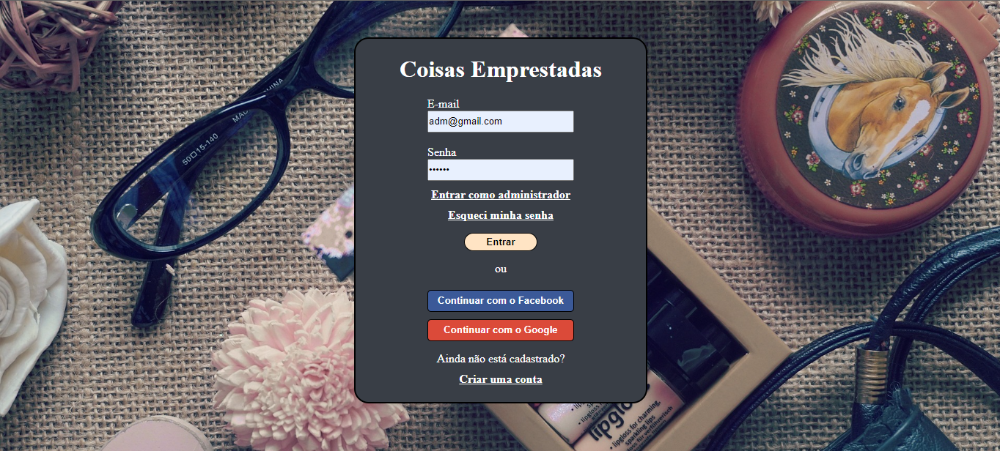
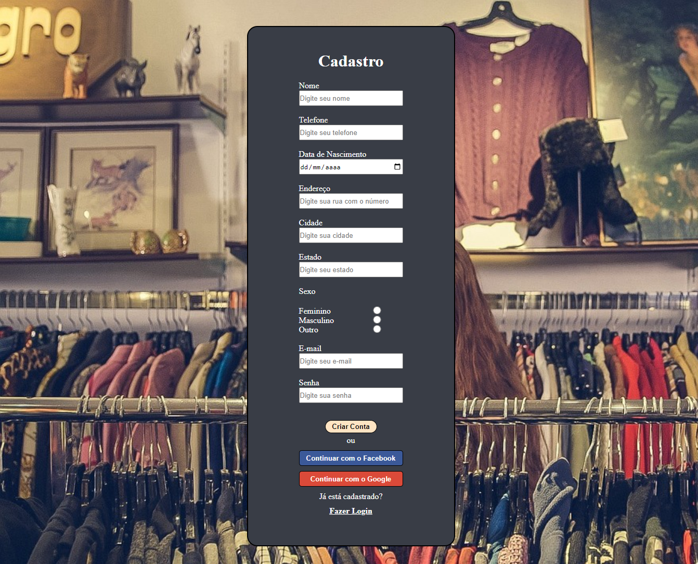

## Empréstimo de Itens
_Essa aplicação se deu início como um trabalho que fiz estudando na __PUCPR__. 
O Sistema Web criado é original e possui [MIT License](https://github.com/EduardoKayke/Projeto_Emprestimo_de_Itens/blob/main/LICENSE).
Disciplina envolvida - Fundamentos de Programação Web._


### O que a aplicação faz?
É um sistema web que envolve clientes e administradores, onde é possível emprestar itens, devolver, adicionar e remover.

__Existem dois usuários criados para teste, você pode usar:__

    email: adm@gmail.com senha: 123456
    email: usuario@gmail.com senha: 123456

__Além disso temos as seguintes telas:__

    Tela de Login
        Usuário e Senha
        Cadastrar novo usuário

    Tela de Cadastrar Novo Usuário
        Formulário de cadastro

    Tela de Cadastrar Itens que o ADMIN pode acessar
        Código do item
        Tipo
        Descrição
    
    Tela de Boas-Vindas
        Lista de Itens emprestados (Cod.Item, Descrição, Data)
        Cadastrar novo empréstimo
        Alterar Dados(usuário e itens-admin)
    
    Tela de Itens Pendentes
        Código do item
        Descrição
        Data do empréstimo
        Data da devolução
    
### Ferramentas utilizadas.
- __HTML__
- __CSS__
- __PHP__
- __MySQL__

### Como rodar a aplicação?
- Primeiro você deve fazer o download do [xampp.](https://www.apachefriends.org/index.html)
- Depois de baixar, você deve ir até a pasta __htdocs__, dependendo do sistema operacional pode mudar, mas geralmente é no caminho a seguir:
    ```code
    C:\xampp\htdocs
    ```
- Clone esse repositório usando o comando abaixo:
    ```code
    https://github.com/EduardoKayke/Projeto_Emprestimo_de_Itens.git
    ```
- Ou realize o download do repositório clicando [aqui](https://github.com/EduardoKayke/Projeto_Emprestimo_de_Itens/archive/refs/heads/main.zip).
- Jogue dentro da pasta __htdocs__ o repositório que acabou de baixar.
- Inicialize a aplicação do xampp e de start no __Apache__ e __MySQL__
- Abra seu navegador e digite no campo da url:
    ```code
    http://localhost/projeto_emprestimo_de_itens/index.html
    ```
- Pronto, a aplicação está rodando!

__OBS: Talvez você tenha que adicionar o caminho do PHP no path do sistema, para que o PHP seja reconhecido pelo sistema operacional.__

## Imagens do Projeto


